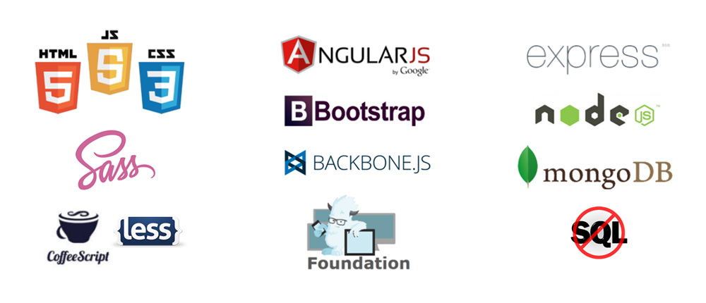

# My-exercises of precourse at Skylab Coders
My evolution and my responses to the exercises from SkyLab Coders

Web where are all exersises of this pre-course:
https://github.com/SkylabCoders/materials/blob/master/preCurs/preCurs.md

During the precourse, for the moment only the wednesday of 17h. to 19h. 
First week (08/02/17)/, a litle presentation, of course and explain the internal function. Also, homework for do it in house. :). https://github.com/agandia9/studySessions/blob/master/studySession_1.md

The second week (15/02/17), we are more people in the classroom. Here starting with the mini-project based in the calculator aplication for show in console the results (https://github.com/agandia9/studySessions/blob/master/studySession_2.md) and more homework for house, https://github.com/agandia9/studySessions/blob/master/studySession_6.md

The thirth week (22/02/17)....
